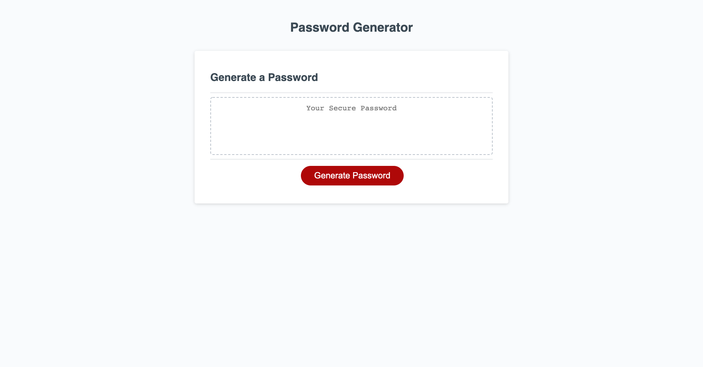

# Password Generator

 [](https://github.com/jdbell123/password-generator/issues)
 [](https://github.com/jdbell123/password-generator/stargazers)
## Table of Contents

* [Reason](#reason)
* [Learnt](#learnt)
* [Take-Aways](#Take-Aways)
* [Installation](#installation)
* [Usage](#usage)
* [Credits](#credits)
* [License](#license)
* [Links](#links)

***

## Reason

The reason for this assignment this week was to learn JavaScript logic. We were given the following User Story and Acceptance Criteria:

```
USER STORY:
AS AN employee with access to sensitive data
I WANT to randomly generate a password that meets certain criteria
SO THAT I can create a strong password that provides greater security
```

```
ACCEPTANCE CRITERIA:
GIVEN I need a new, secure password
WHEN I click the button to generate a password
THEN I am presented with a series of prompts for password criteria
WHEN prompted for password criteria
THEN I select which criteria to include in the password
WHEN prompted for the length of the password
THEN I choose a length of at least 8 characters and no more than 128 characters
WHEN prompted for character types to include in the password
THEN I choose lowercase, uppercase, numeric, and/or special characters
WHEN I answer each prompt
THEN my input should be validated and at least one character type should be selected
WHEN all prompts are answered
THEN a password is generated that matches the selected criteria
WHEN the password is generated
THEN the password is either displayed in an alert or written to the page
```

---

## Learnt

Working on this project I have learnt about the following things:

    1 - Mainly JavaScript logic

---

## Take-Aways

Start small and add to your code. Also, don't forget to commit often.

---

## Installation

This project doesn't require any install steps. Just navigate to the URL to see the website.

* [Links](#links)

---

## Usage 

Here is a screenshot of the finished webpage:

Password Generator Page (index.html)



---

## Credits

As always thanks to my BFF Google for being there in my hours of need. Also, to my fellow class mates for the study groups. Last but not least a thank you to the tutor and TAs for their guidance and support on this project. 

---

## License


Licensed under the [MIT](./LICENSE) license.


---

## Links

[GitHub Repo](https://github.com/jdbell123/password-generator)

[Website](https://jdbell123.github.io/password-generator/)